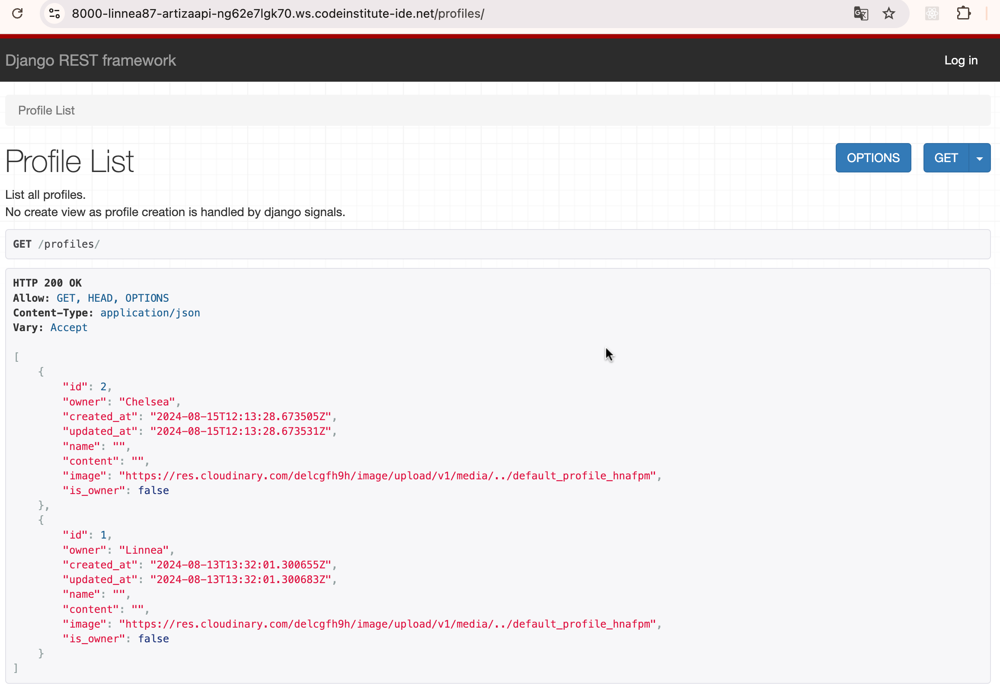
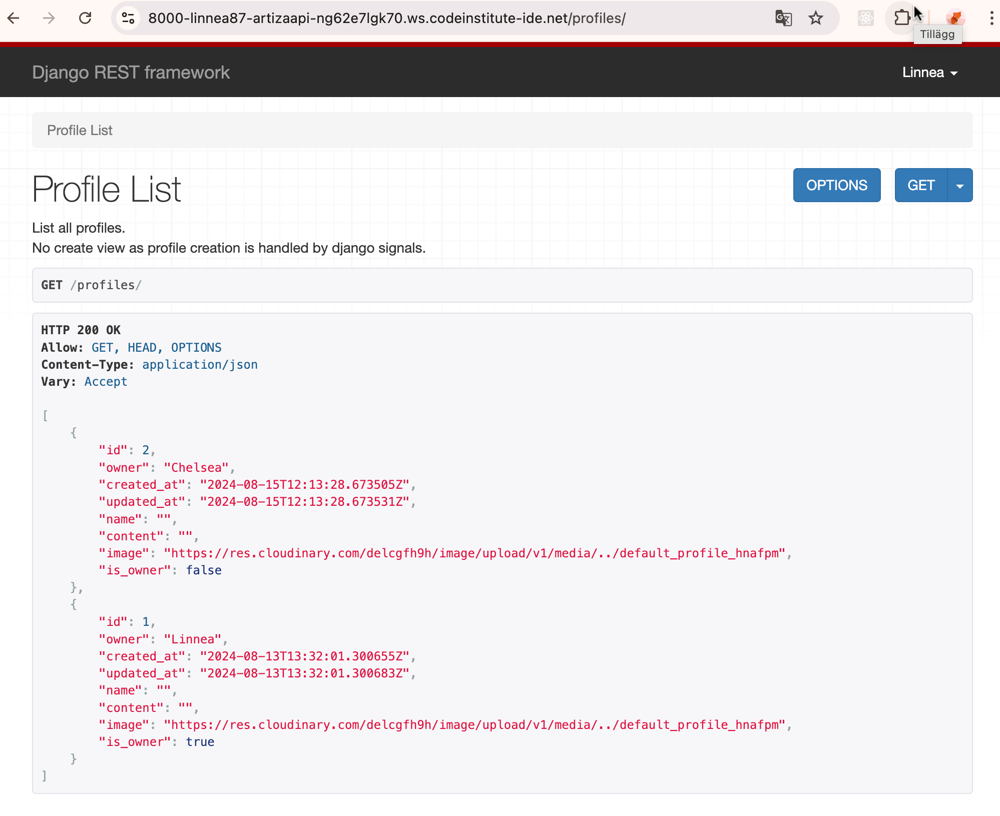
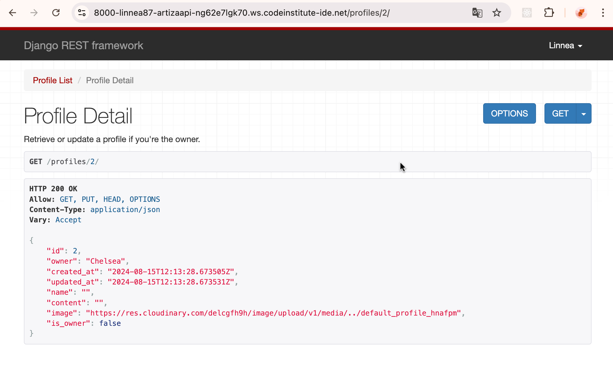
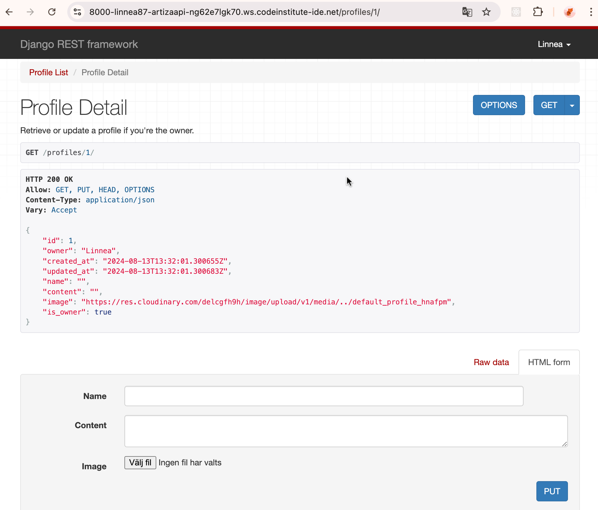
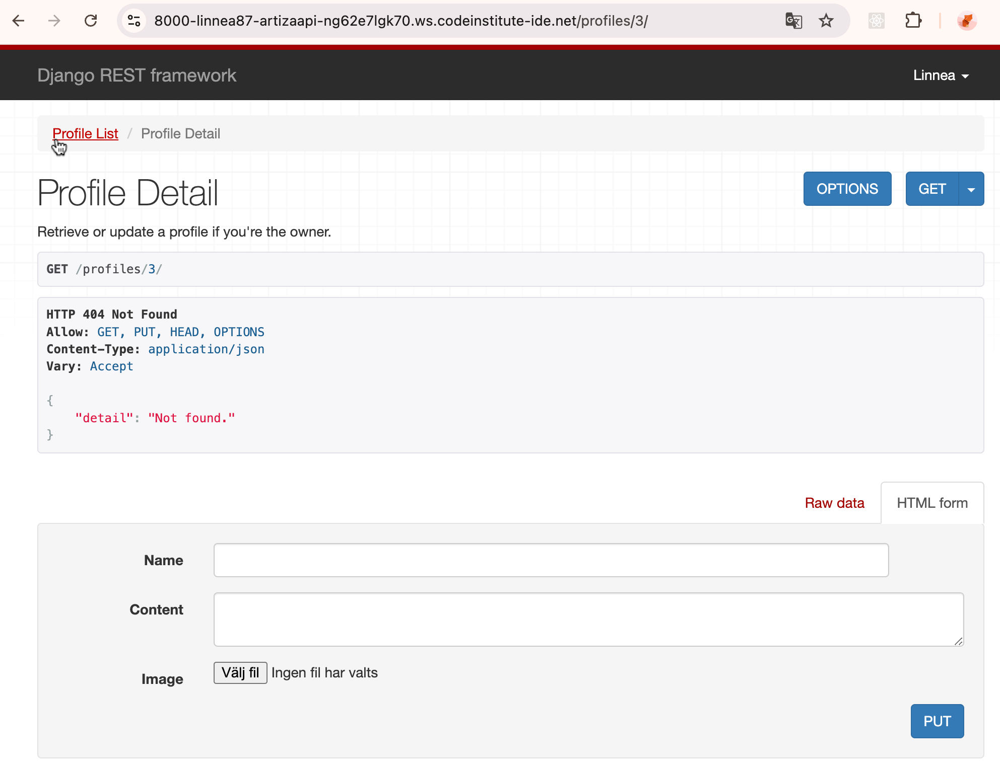

# ARTiza API

## Table of contents

- [Purpose of the API](#purpose-of-the-api)
- [Testing](#testing)
    - [Manual Testing](#manual-testing)

## Purpose of the API

The purpose of the API is to serve as the Back-end for the Front-end of the 5th project for code institute. This is needed for posting and getting data from endpoints and to perform Create, Read, Update and Delete operations to objects entered by Users via Front-end.

## Testing

### Manual Testing

All the testing was completed during each step. Going into the framework of the local server and typing in profiles, posts, likes, comments, and followers at the end of the link, as this example; *8000-linnea87-artizaapi-ng62e7lgk70.ws.codeinstitute-ide.net/profiles*

* A list of all profiles is displayed regardless of whether users are logged in or not

* When users visit other users' profiles, it says that the visiting user is not the owner of that profile. The CRUD form is also not displayed if the users are not authorized

* If the user is the owner of the profile, this is also displayed. As well as the CRUD form is displayed if the user is authorized

* if users try to access a profile or page that does not exist, a 404 error is displayed

