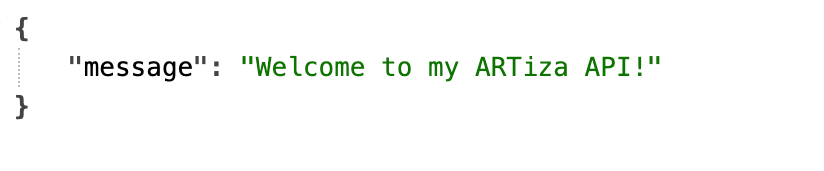

# ARTiza API



This is my RESTful API, developed for my frontend React project, ARTiza. This is needed for posting and getting data from endpoints and to perform Create, Read, Update and Delete operations to objects entered by Users via the Front-end.

The API is deployed here: [Artiza API](https://artiza-api-fbf88e8a2da5.herokuapp.com)

And the deployed front-end is here:

ARTiza is a versatile app designed to meet the needs of artists of all levels, from beginners to hobbyists and professionals. In the app, users can upload their artwork, receive feedback through likes and comments, and build a creative community by following other artists. ARTiza offers a platform where both inspiration and creativity can flow, while artists can showcase their work and network with like-minded people in the art world.


## Table of contents

- [User stories](#user-stories)
- [Testing](#testing)
    - [Validators](validators)
    - [Unit Testing](#unit-testing)
    - [Manual Testing](#manual-testing)
- [Project Setup](#project-setup)
- [Deployment](#deployment)
    - [JWT tokens](#jwt-tokens)
    - [Preparing the API for deployment](#preparing-the-api-for-deployment)
        - [Root Route](#root-route)
        - [Pagination](#pagination)
        - [JSON Renderer](#json-renderer)
        - [Date and Time formatting - General Formatting](#date-and-time-formatting---general-formatting)
        - [Date and Time formatting - Comments and Post](#date-and-time-formatting---comments-and-post)
    - [Create PostgreSQL Database](#create-postgresql-database)
    - [Create Heroku App](#create-heroku-app)
    - [Project preparation for IDE](#project-preparation-for-ide)
    - [Install package to run the project on Heroku](#install-package-to-run-the-project-on-heroku)
- [Heroku deployment](#heroku-deployment)
- [Technologies Used](#technologies-used)
    - [Languages](#languages)
    - [Frameworks](#frameworks)
    - [Libraries](#libraries)
        - [Authentication](#authentication)
        - [Database](#database)
        - [Image Handling](#image-handling)
        - [Utilities](#utilities)
    - [Database Used](#database-used)
    - [Image Storage](#image-storage)
    - [Deployment Service](#deployment-service)
- [Credits](#credits)
    - [Sources](#sources)
    - [Media](#media)
    - [Acknowledgments](#acknowledgments)

## User stories

I have included User Stories links to the [GitHub Issues](https://github.com/Linnea87/artiza-api/issues) for ARTizas backend API, as well as the [KANBAN Board](https://github.com/users/Linnea87/projects/11).


## Testing

### Validators

All files passed through [CI Python Linter](https://pep8ci.herokuapp.com/) without error. Minor indentation and whitespace errors were corrected. No errors left.

### Unit Testing

With guidance from the Moments walkthrough, I have created some automated tests, all passing.

* Tests for my Post views can be found here: [Posts view tests](https://github.com/Linnea87/artiza-api/blob/main/posts/tests.py)

* Tests for my Comment views can be found here: [Comments view tests](https://github.com/Linnea87/artiza-api/blob/main/comments/tests.py)

* Tests for my Profile views can be found here: [Profiles view tests](https://github.com/Linnea87/artiza-api/blob/main/profiles/tests.py)

* Tests for my Like views can be found here: [Likes view tests](https://github.com/Linnea87/artiza-api/blob/main/likes/tests.py)


### Manual Testing

Each title was tested manually and marked with an X for yes if it works, and no if it does not.

|   root_route                                       |   Yes  |   No  |
|----------------------------------------------------|--------|-------|
|   The root_route url loads                         |   X    |       |
|   Welcome message is displayed on landing page     |   X    |       |


|   Profiles                                                           |   Yes  |   No  |
|----------------------------------------------------------------------|--------|-------|
|   profiles/ is accessible if not logged in as read only              |   X    |       |
|   profiles/<int:pk>/ is accessible if not logged in as read only     |   X    |       |
|   profiles/<int:pk>/ is accessible if not logged in as read only     |   X    |       |
|   Upon registering, a new profile is created for the user            |   X    |       |
|   As the owner of a profile, I can update it                         |   X    |       |
|   I can add a profile image                                          |   X    |       |
|   If I don't own the profile, I can only view it                     |   X    |       |


|   Posts                                                                   |   Yes  |   No  |
|---------------------------------------------------------------------------|--------|-------|
|   posts/ is accessible if not logged in as read only                      |   X    |       |
|   posts/<int:pk>/ is accessible if not logged in as read only             |   X    |       |
|   I can see but not add posts if not logged in                            |   X    |       |
|   If I am signed in, I can add a post                                     |   X    |       |
|   Posts can not be edited if not logged in as the owner                   |   X    |       |
|   Posts can not be deleted if not logged in as its owner                  |   X    |       |
|   Posts can be edited by its owner                                        |   X    |       |
|   Posts can be deleted by its owner                                       |   X    |       |
|   comments_count increments by one when I add a comment to a post         |   X    |       |
|   likes_count increments by one when I add a like to a post               |   X    |       |
|   I can upload an image to a post                                         |   X    |       |
|   File extension must be jpg, jpeg or png when uploading an image         |   X    |       |
|   If file extension is not jpg, jpeg or png an error informs the user     |   X    |       |


|   Likes                                                           |   Yes  |   No  |
|-------------------------------------------------------------------|--------|-------|
|   likes/ is accessible if not logged in as read only              |   X    |       |
|   likes/<int:pk>/ is accessible if not logged in as read only     |   X    |       |
|   I can see likes when not logged in                              |   X    |       |
|   If I am signed in, I can add a like to a post                   |   X    |       |
|   If I am signed in, I can add a like to a post                   |   X    |       |
|   Likes can not be deleted if not logged in as the owner          |   X    |       |
|   Likes can be deleted if logged in as its owner                  |   X    |       |
|   I can not like the same thing twice                             |   X    |       |


|   Comments                                                           |   Yes  |   No  |
|----------------------------------------------------------------------|--------|-------|
|   comments/ is accessible if not logged in as read only              |   X    |       |
|   comments/<int:pk>/ is accessible if not logged in as read only     |   X    |       |
|   I can see likes when not logged in                                 |   X    |       |
|   Can read, but not create comments if not logged in                 |   X    |       |
|   If I am signed in, I can create a comment                          |   X    |       |
|   comments can not be edited if not logged in                        |   X    |       |
|   comments can not be deleted if not logged in                       |   X    |       |
|   comments can be edited by its owner                                |   X    |       |
|   comments can be deleted by its owner                               |   X    |       |


|   Followers                                                           |   Yes  |   No  |
|-----------------------------------------------------------------------|--------|-------|
|   Followers/ is accessible if not logged in as read only              |   X    |       |
|   Followers/<int:pk>/ is accessible if not logged in as read only     |   X    |       |
|   If I am signed in,I can follow another users profile                |   X    |       |
|   If I am signed in, I can unfollow a profile I already follow        |   X    |       |


|   Categories                                                           |   Yes  |   No  |
|------------------------------------------------------------------------|--------|-------|
|   categories/ is accessible if not logged in as read only              |   X    |       |
|   categories/<int:pk>/ is accessible if not logged in as read only     |   X    |       |
|   If I am a authenticated user I can    update the categories          |   X    |       |
|   If I am a authenticated user I can    create categories              |   X    |       |
|   If I am a authenticated user I can    Delete categories              |        |       |


## Project Setup

* Create a new repository using the Code Institute template repository.

* To install Django, run the command:

    ```
     pip3 install 'django<4'
    ```


* To create a new app, run the command:

    ```
    django-admin startproject my_api .
    ``` 

* To create a new superuser, run the command: 
    
    ```
    python3 manage.py createsuperuser  
    ```

* To install Cloudinary Storage, run the command:
   
   ```
    pip install django-cloudinary-storage 
    ```

* To add the image processing capabilities thats are neede in the project, run the command:

    ```
    pip install Pillow 
    ```


* Once these dependencies are installed we need to add them to the "Installed apps" section in settings.py:

    *Note the placement and terms used for this input into installed apps*

    ```
    'cloudinary_storage',
    'django.contrib.staticfiles',
    'cloudinary',
    ```

* Create an env.py file in the top directory.

    * Inside the env.py file, import the os module and set up the os.environ with the Cloudinary URL you can retrieve from the account you've set up.

* In the settings.py file, set up a variable called "CLOUDINARY_STORAGE" and use the environment variable used to set up in the env.py file to declare this value.

* Next, define the setting called "MEDIA_URL" and set it to "/media/" so the settings know where to store our image files.

* Finally, define a variable called "DEFAULT_FILE_STORAGE" and set it to "MediaCloudinaryStorage".

## Deployment

### JWT tokens
The first step of deployment is setting up the JWT tokens:

* First install the package in the terminal window, using the command:

    ```
    pip install dj-rest-auth
    ```

* In the settings.py file add the following to the "Installed Apps" section.

    ```
    'rest_framework.authtoken',
    'dj_rest_auth',
    ```

* Next, add the following URLs to the urlpatterns list:

    ```
    path('dj-rest-auth/', include('dj_rest_auth.urls')),
    ```

* In the command terminal, migrate the database just added by typing:

    ```
    python manage.py migrate
    ```

* Next we want to add the feature to enable the registration of users. Type the following into the terminal:

    ```
    pip install 'dj-rest-auth[with_social]'
    ```

* Add the following to the "Installed Apps" section in the settings.py file:

    ```
    'django.contrib.sites',
    'allauth',
    'allauth.account',
    'allauth.socialaccount',
    'dj_rest_auth.registration',
    ```

Finally, add JWT tokens functionality:

* Install the djangorestframework-simplejwt package by typing the following into the terminal command window:

    ```
    pip install djangorestframework-simplejwt
    ```

* In the env.py file, create a session authentication value (differentiates between Dev and Prod mode):

    ```
    os.environ['DEV'] = '1'
    ```

* In the settings.py file, use the Dev value above to differentiate between Dev and Prod Modes & add pagination which is placed under SITE_ID:

    ```
    REST_FRAMEWORK = {
        'DEFAULT_AUTHENTICATION_CLASSES': [( 
            'rest_framework.authentication.SessionAuthentication' 
            if 'DEV' in os.environ 
            else 'dj_rest_auth.jwt_auth.JWTCookieAuthentication'
        )]
    }
    ```

* To enable token authentication, put the following under the above step:
    
    ```
    REST_USE_JWT = True
    ```

* To ensure tokens are sent over HTTPS only, add the following:

    ```
    JWT_AUTH_SECURE = True
    ```

* Next, declare cookie names for the access and refresh tokens by adding:
    
    ```
    JWT_AUTH_COOKIE = 'my-app-auth'
    JWT_AUTH_REFRESH_COOKIE = 'my-refresh-token'
    ```

Now we need to add the profile_id and profile_image to fields returned when requesting logged in user’s details:

* Create a new serializers.py file in the api folder. Then import the following files at the top of the new serializers file and create the profile_id and profile_image fields:

    ```
    from dj_rest_auth.serializers import UserDetailsSerializer
    from rest_framework import serializers

    class CurrentUserSerializer(UserDetailsSerializer):
    profile_id = serializers.ReadOnlyField(source='profile.id')
    profile_image = serializers.ReadOnlyField(source='profile.image.url')

    class Meta(UserDetailsSerializer.Meta):
        fields = UserDetailsSerializer.Meta.fields + (
            'profile_id', 'profile_image'
        )
    ```

* In settings.py, overwrite the default USER_DETAILS_SERIALIZER, below the JWT_AUTH_REFRESH_COOKIE = 'my-refresh-token' :

    ```
    REST_AUTH_SERIALIZERS = {'USER_DETAILS_SERIALIZER': '<your appname>.serializers CurrentUserSerializer'}
    ```

* Next, in the terminal command window:

    1: Run migrations

    ```
    python manage.py migrate
    ```
    2: Update the requirements text file:

    ```
    pip freeze > requirements.txt
    ```
    
    3: git add, commit and push.

Bug Fix - dj-rest-auth doesn’t allow users to log out:

* In the <projectname>_api/views.py, import JWT_AUTH settings from settings.py

    ```
    from .settings import (
    JWT_AUTH_COOKIE, JWT_AUTH_REFRESH_COOKIE, JWT_AUTH_SAMESITE,
    JWT_AUTH_SECURE,
    )
    ```

* Write a logout view. It can be found [here](https://github.com/Linnea87/artiza-api/blob/main/artiza_api/views.py)

* Import the logout view in the <projectname>_api/urls.py

    ```
    from .views import root_route, logout_route
    ```

* Include it in the urlpatterns list, above the default dj-rest-auth urls, so that it is matched first.

    ```
    urlpatterns = [
        path('', root_route),
        path('admin/', admin.site.urls),
        path('api-auth/', include('rest_framework.urls')),
        path('dj-rest-auth/logout/', logout_route),
        path('dj-rest-auth/', include('dj_rest_auth.urls')),
        ...
    ]
    ```

    Add, Commit and Push your code to GitHub.

### Preparing the API for deployment
#### Root Route

* Create a views.py file in the API folder. Set up the imports in the views.py file:

    ```
    from rest_framework.decorators import api_view
    from rest_framework.response import Response
    ```

* Create root route and return custom message:

    ```
    @api_view()
    def root_route(request):
        return Response({"message": "Welcome to my API!"})
    ```

* In the urls.py file, import:

    ```
    from .views import root_route
    ```

* Add the URL to urlpatterns list:

    ```
    urlpatterns = [
    path('', root_route)
    ]
    ```

* In the root route, no longer displays the 404 Error

#### Pagination

* In the settings.py file, inside the REST_FRAMEWORK object, add Pagination:

    ```
    REST_FRAMEWORK = {
    ...,
    'DEFAULT_PAGINATION_CLASS':  'rest_framework.pagination.PageNumberPagination',
    'PAGE_SIZE': 10,
    }
    ```

#### JSON Renderer

* In the settings.py file, set JSON Renderer if Dev environment is not present. Placed below, but separate from, the REST_FRAMEWORK list:
    ```
    REST_FRAMEWORK = {
    ...
    }
    if 'DEV' not in os.environ:
        REST_FRAMEWORK['DEFAULT_RENDERER_CLASSES'] = [
            'restframework.renderers.JSONRenderer'
        ]
    ```

#### Date and Time formatting - General Formatting

* In the settings.py file, format the Date and time in REST_FRAMEWORK list:

    ```
    REST_FRAMEWORK = {
    ...
    'DATETIME_FORMAT': '%d %b %Y'
    }
    ```

#### Date and Time formatting - Comments and Post

* In the Comment app, inside the serializers.py file. Then set the imports up in the file:

    ```
    from django.contrib.humanize.templatetags.humanize import naturaltime
    ````

* Set fields within the Serializer class:

    ```
    created_at = serializers.SerializerMethodField()
    updated_at = serializers.SerializerMethodField()
    ```

* Set methods, which are placed underneath fields:

    ```
    def get_created_at(self, obj):
        return naturaltime(obj.created_at)
    def get_updated_at(self, obj):
        return naturaltime(obj.updated_at)
    ```

* Next add, commit, and push the new additions.

### Create PostgreSQL Database

* Log in to [Elephant SQL](https://www.elephantsql.com) to access your dashboard

* Click “Create New Instance”

* Set up your plan

    * Give your plan a Name (this is commonly the name of the project)
    * Select the Tiny Turtle (Free) plan
    * You can leave the Tags field blank
    * Select “Select Region”

* Select a data center near you

* Then click “Review”

* Check your details are correct and then click “Create instance”

* Return to the ElephantSQL dashboard and click on the database instance name for this project

* In the URL section, click the copy icon to copy the database URL

### Create Heroku App

* Log into Heroku, and create a new app. (The name must be unique)

* Click “Select Region”, then click “Review” and then click "Create instance".

* Go back to the ElephantSQL dashboard and click on the database instance name for this project.

* Copy your ElephantSQL database URL using the Copy icon. It will start with postgres://

* Open the Settings tab, and click "Reveal config vars".

* Add a Config Var DATABASE_URL, and for the value, copy in your database URL from ElephantSQL (do not add quotation marks)

### Project preparation for IDE

* In the terminal, install dj_database_url and psycopg2, both of these are needed to connect to your external database:

    ```
    pip3 install dj_database_url==0.5.0 psycopg2
    ```

* In settings.py file, import dj_database_url underneath the import for os:

    ```
    import os import dj_database_url
    ```

* Update the DATABASES section to the following:

    ```
    if 'DEV' in os.environ:
    DATABASES = {
        'default': {
            'ENGINE': 'django.db.backends.sqlite3',
            'NAME': BASE_DIR / 'db.sqlite3',
        }
    }
    else:
        DATABASES = {
            'default': dj_database_url.parse(os.environ.get("DATABASE_URL"))
        }
    ```

This ensures that when you have an environment variable for DEV in your environment the code will connect to the sqlite database here in your IDE. Otherwise it will connect to your external database, provided the DATABASE_URL environment variable exist.

* In the env.py file, add a new environment variable with the key set to DATABASE_URL, and the value to your ElephantSQL database URL:

    ```
    os.environ['DATABASE_URL'] = "<your PostgreSQL URL here>"
    ```

* Temporarily comment out the DEV environment variable so that the IDE can connect to my external database

* Migrate your database models to your new database:

    ```
    python3 manage.py migrate
    ```

* Create a superuser for your new database and follow the steps to create your superuser username and password:

    ```
    python3 manage.py createsuperuser
    ```

* Confirming database:

    * On the ElephantSQL page for your database, in the left side navigation, select “BROWSER”

    * Click the Table queries button, select auth_user

    * Click “Execute”, it should display the new created superuser details. This confirms the tables have been created and can add data to the database

### Install package to run the project on Heroku

* In the terminal of your IDE workspace, install gunicorn:

    ```
    pip3 install gunicorn django-cors-headers
    ```

* Update your requirements.txt:

    ```
    pip freeze --local > requirements.txt
    ```

* Create Procfile (noting the capital "P"). Inside the file add:

    ```
    release: python manage.py makemigrations && python manage.py migrate
    web: gunicorn drf_api.wsgi 
    ```

* In the settings.py, update the value of "ALLOWED_HOSTS" to:

    ```
    ALLOWED_HOSTS = ['localhost', '<your_app_name>.herokuapp.com']
    ```

* In the command terminal, install CORS, by typing: 
    
    ```
    pip install django-cors-headers
    ```

* Add corsheaders to INSTALLED_APPS:

    ```
    INSTALLED_APPS = [
    ...
    'dj_rest_auth.registration',
    'corsheaders',
    ...
    ]
    ```

* Add to MIDDLEWARE list: (place at the top of the MIDDLEWARE list)

    ```
    MIDDLEWARE = [
    'corsheaders.middleware.CorsMiddleware',
    ...
    ]
    ```

* Set the ALLOWED_ORIGINS for the network requests made to the server: (placed under MIDDLEWARE_LIST)

    ```
    if 'CLIENT_ORIGIN' in os.environ:
        CORS_ALLOWED_ORIGINS = [
            os.environ.get('CLIENT_ORIGIN')
    ]
    else:
        CORS_ALLOWED_ORIGIN_REGEXES = [
            r"^https://.*\.gitpod\.io$",
    ]
    ```

* Enable sending cookies in cross-origin requests so that users can get authentication functionality:

    ```
    else:
    CORS_ALLOWED_ORIGIN_REGEXES = [
        r"^https://.*\.gitpod\.io$",
    ]
    CORS_ALLOW_CREDENTIALS = True
    ```

*   Allow Cookies and allow front end app and API be deployed to different platforms:
    ```
    JWT_AUTH_COOKIE = 'my-app-auth'
    JWT_AUTH_REFRESH_COOKE = 'my-refresh-token'
    JWT_AUTH_SAMESITE = 'None'
    ```

* Remove the value for SECRET_KEY and replace with the following code to use an environment variable instead:

    **SECURITY WARNING: keep the secret key used in production secret!**

    ```
    SECRET_KEY = os.getenv('SECRET_KEY')
    ```

* Set a NEW value for your SECRET_KEY environment variable in env.py, do NOT use the same one that has been published to GitHub in your commits:

    ```
    os.environ.setdefault("SECRET_KEY", "CreateANEWRandomValueHere")
    ```

* Replace the DEBUG Setting to be only true in Dev and False in Prod Modes:

    ```
    DEBUG = 'DEV' in os.environ
    ```

* Comment DEV back in env.py

* Ensure the project requirements.txt file is up to date:

    ```
    pip freeze --local > requirements.txt
    ```

* Add, commit and push your code to GitHub

## Heroku deployment

* In Heroku - Add your config vars i.e. copy and paste values from env.py into Heroku Config Vars, and add the DISABLE_COLLECTSTATIC var:

    ***CLOUDINARY_URL***

    ***SECRET_KEY***

    ***DISABLE_COLLECTSTATIC = 1***

* In the deploy tab:

    * Select the Deployment Method (GitHub), select the project repository name from Github, and connect. Next in the Manual deploy section, choose the Master Branch, then click Deploy Branch.

* Once complete, click "Open App" to view

## Technologies Used

### Languages

This api was written using Python.

### Frameworks

* Django

    * The core framework, providing the foundation for this api.

* django-rest-framework

    * A framework building on top of Django, used for creating RESTful APIs.

### Libraries

#### Authentication

* dj-rest-auth

    * Lets django-rest-framework provide authentication endpoints in an easy way.

* django-allauth

    * Comprehensive authentication app for Django.

* djangorestframework-simplejwt

    * JSON Web Token based authentication, which will be used for authentication from the frontend.

#### Database

* dj-database-url

    * Used to help parse urls for easy configuration in Django.

* psycopg2

    * A PostgreSQL adapter for Python.

#### Image Handling

* cloudinary

    * Used to interact with Cloudinary, cloud based image storage.

* django-cloudinary-storage

    * Integrates Cloudinary to be able to use it as storage for media in Django.

* Pillow

    * Used for image processing.

#### Utilities

* gunicorn

    * A WSGI server used in production, needed for deployment.

* django-cors-headers

    * Adds Cross-Origin Resource Sharing headers. Used to allow requests to a Django application from other origins.

* django-taggit

    * Used for adding tags to Posts in this project, makes it easier for users to search content.

#### Database Used

I used a PostgreSQL database for this project, at [Elephant SQL](https://www.elephantsql.com).

#### Image Storage

[Cloudinary](https://cloudinary.com) was used for image storage.

#### Deployment Service

[Heroku](https://id.heroku.com/login) was used to deploy the project.

## Credits

### Sources

* I have used The Code Institute Advanced Front-end specialisation Django REST Framework guide, as a basis to create and deploy this API. I also used the Moments walkthrough project as an inspiration and expanded my project with new custom models and functionality;

    * categories app

* As always i have used [Stack Overflow](https://stackoverflow.com) for trouble shooting

### Media

The media for this API consists of the default images, sourced from the API walkthrough and uploaded on Cloudinary.

### Acknowledgments

My mentor at Code Institute - [Martina Terlevic](https://github.com/SephTheOverwitch) for her invaluable support and insightful feedback during the development of this project.

